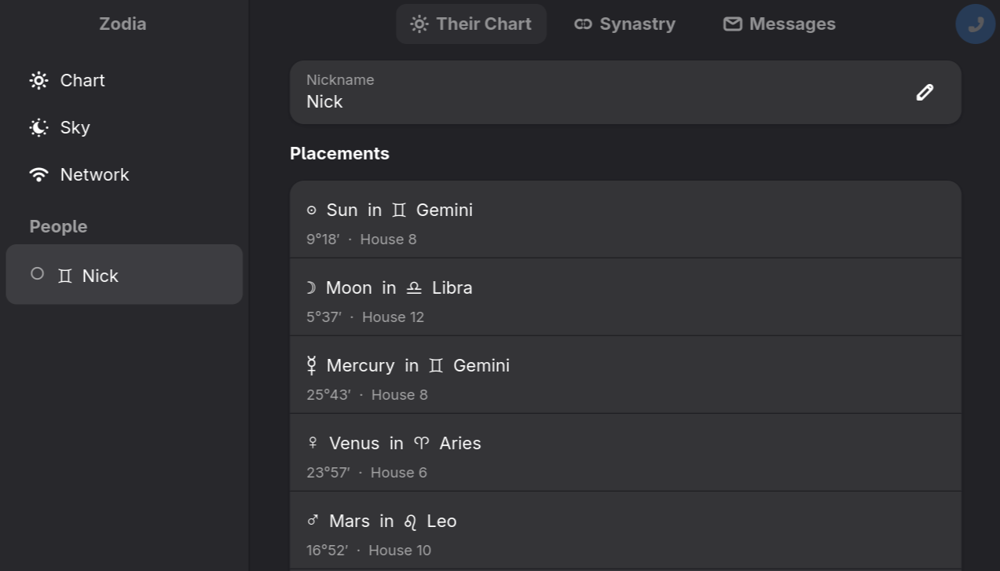

# Zodia

A peer-to-peer astrological companion. Zodia connects you with others who share meaningful chart alignments — no accounts, no servers — just enabling technology for the astrology-minded.



---

## How it works

Zodia announces a coarse astrological fingerprint (solar month + approximate location) to a local gossip network. Nearby peers with compatible aspects appear in the Network view. Adding someone opens a direct encrypted channel where you exchange exact birth data by mutual consent, compute synastry, and can chat or call.

Everything stays between you and the people you choose to connect with thanks to [p2panda](https://p2panda.org)'s most eloquent networking toolbox.

## Privacy

Everything is stored locally. Zodia announces only your solar month and a rough location (~600 km) to the gossip network. Exact birth data is only exchanged after you explicitly choose to connect with someone. Because there is no central authority, Zodia cannot verify peer identities — share at your own discretion.

## Building from source

**Linux (Ubuntu 24.04 or equivalent)**
```sh
sudo apt install libgtk-4-dev libadwaita-1-dev libopus-dev libasound2-dev pkg-config
cargo build --release --bin zodia
```

**macOS**
```sh
brew install gtk4 libadwaita pango opus pkg-config glib
cargo build --release --bin zodia
```

Requires Rust 1.75+ and GTK 4 / libadwaita 1.4+.

## License

Zodia is free software: you can redistribute it and/or modify it under the terms of the [GNU Affero General Public License](LICENSE) as published by the Free Software Foundation, either version 3, or (at your option) any later version.

Because Zodia is peer-to-peer software, the AGPL's network-use clause applies: if you modify Zodia and let others connect to your modified version, you must make the source available to them under the same terms.
